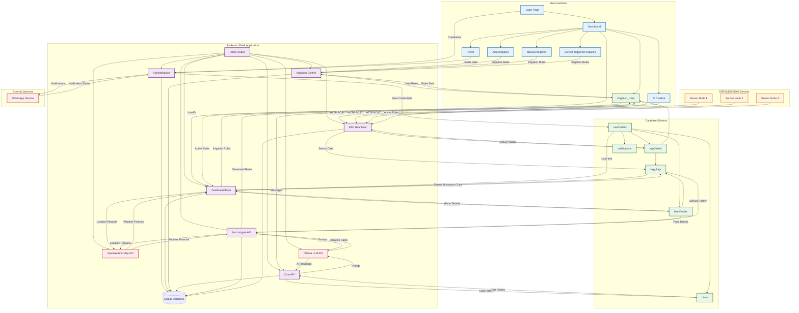

```mermaid
flowchart TD
    %% User Interactions
    subgraph UserInterface[User Interface]
        direction LR
        Login[Login Page] --> Dashboard[Dashboard]
        Dashboard --> AutoIrrigation[Auto Irrigation]
        Dashboard --> ManualIrrigation[Manual Irrigation]
        Dashboard --> SensorIrrigation[Sensor Triggered Irrigation]
        Dashboard --> Chat[AI Chatbot]
        Dashboard --> Profile[Profile]
        Dashboard --> IrrigationRules[Irrigation Rules]
    end

    %% Backend Components
    subgraph Backend[Backend - Flask Application]
        direction TB
        Routes[Flask Routes] --> Auth[Authentication]
        Routes --> DashboardData[Dashboard Data]
        Routes --> IrrigationCtrl[Irrigation Control]
        Routes --> ChatAPI[Chat API]
        Routes --> AutoIrrigateAPI[Auto Irrigate API]
        Routes --> Heartbeat[ESP Heartbeat]
        
        Auth --> DB[(SQLite Database)]
        DashboardData --> DB
        IrrigationCtrl --> DB
        ChatAPI --> DB
        AutoIrrigateAPI --> DB
        Heartbeat --> DB
        
        Routes --> WeatherAPI[OpenWeatherMap API]
        Routes --> OllamaAPI[Ollama LLM API]
    end

    %% Database Schema
    subgraph Database[Database Schema]
        direction TB
        Users[userDetails] --> Farms[farmDetails]
        Users --> ESPDevices[espDetails]
        Users --> Notifications[notifications]
        Farms --> ESPLogs[esp_logs]
        ESPDevices --> ESPLogs
        ESPDevices --> IrrigationRules[irrigation_rules]
        Users --> Chats[chats]
    end

    %% ESP Devices
    subgraph ESP[ESP32/ESP8266 Devices]
        direction LR
        Sensor1[Sensor Node 1] -->|HTTP POST| Heartbeat
        Sensor2[Sensor Node 2] -->|HTTP POST| Heartbeat
        Sensor3[Sensor Node 3] -->|HTTP POST| Heartbeat
    end

    %% External Services
    subgraph External[External Services]
        WeatherAPI
        OllamaAPI
        WhatsApp[WhatsApp Service]
    end

    %% Data Flow Connections
    %% User to Backend
    Login -->|Credentials| Auth
    Dashboard -->|UserID| DashboardData
    AutoIrrigation -->|Irrigation Rules| IrrigationCtrl
    ManualIrrigation -->|Irrigation Rules| IrrigationCtrl
    SensorIrrigation -->|Irrigation Rules| IrrigationCtrl
    Chat -->|Messages| ChatAPI
    Profile -->|Profile Data| Auth
    IrrigationRules -->|Rules Data| IrrigationCtrl

    %% Backend to Database
    Auth -->|User Credentials| Users
    DashboardData -->|Weather Data| Farms
    DashboardData -->|Irrigation Rules| IrrigationRules
    DashboardData -->|Sensor Data| ESPLogs
    IrrigationCtrl -->|New Rules| IrrigationRules
    ChatAPI -->|Chat History| Chats
    AutoIrrigateAPI -->|Generated Rules| IrrigationRules
    Heartbeat -->|Sensor Data| ESPLogs
    Heartbeat -->|Device Status| ESPDevices

    %% Database to Backend
    Users -->|User Info| DashboardData
    Farms -->|Farm Details| DashboardData
    Farms -->|Farm Details| AutoIrrigateAPI
    ESPDevices -->|ESP ID| Heartbeat
    ESPLogs -->|Sensor History| DashboardData
    ESPLogs -->|Sensor History| AutoIrrigateAPI
    IrrigationRules -->|Active Rules| Heartbeat
    IrrigationRules -->|Active Rules| DashboardData
    Chats -->|Chat History| ChatAPI

    %% Backend to External Services
    DashboardData -->|Location Request| WeatherAPI
    AutoIrrigateAPI -->|Location Request| WeatherAPI
    ChatAPI -->|Prompt| OllamaAPI
    AutoIrrigateAPI -->|Prompt| OllamaAPI
    Auth -->|Notifications| WhatsApp

    %% External Services to Backend
    WeatherAPI -->|Weather Forecast| DashboardData
    WeatherAPI -->|Weather Forecast| AutoIrrigateAPI
    OllamaAPI -->|AI Response| ChatAPI
    OllamaAPI -->|Irrigation Rules| AutoIrrigateAPI
    WhatsApp -->|Notification Status| Auth

    %% Styling
    classDef user fill:#e3f2fd,stroke:#1565c0,stroke-width:2px;
    classDef backend fill:#f3e5f5,stroke:#6a1b9a,stroke-width:2px;
    classDef database fill:#e8f5e8,stroke:#2e7d32,stroke-width:2px;
    classDef esp fill:#fff3e0,stroke:#ef6c00,stroke-width:2px;
    classDef external fill:#ffebee,stroke:#c62828,stroke-width:2px;
    
    class Login,Dashboard,AutoIrrigation,ManualIrrigation,SensorIrrigation,Chat,Profile,IrrigationRules user;
    class Routes,Auth,DashboardData,IrrigationCtrl,ChatAPI,AutoIrrigateAPI,Heartbeat backend;
    class Users,Farms,ESPDevices,Notifications,ESPLogs,IrrigationRules,Chats database;
    class Sensor1,Sensor2,Sensor3 esp;
    class WeatherAPI,OllamaAPI,WhatsApp external;
```