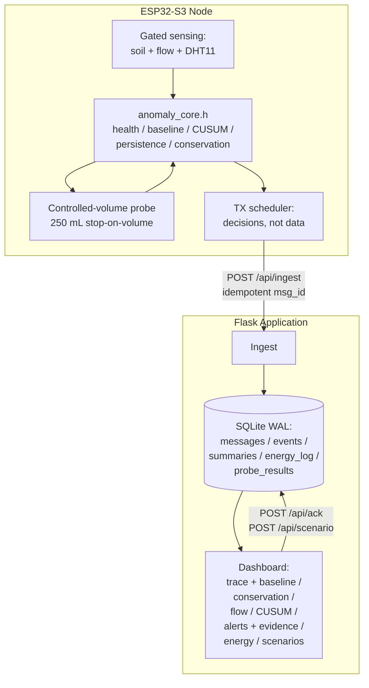

```mermaid
flowchart TD
    %% Edge node
    subgraph Node[ESP32-S3 Node]
        direction TB
        Sense[Gated sensing:\nsoil + flow + DHT11] --> Core[anomaly_core.h\nhealth / baseline / CUSUM /\npersistence / conservation]
        Core --> Probe[Controlled-volume probe\n250 mL stop-on-volume]
        Probe --> Core
        Core --> TX[TX scheduler:\ndecisions, not data]
    end

    %% Backend
    subgraph Backend[Flask Application]
        direction TB
        TX -->|POST /api/ingest\nidempotent msg_id| Ingest[Ingest]
        Ingest --> DB[(SQLite WAL:\nmessages / events /\nsummaries / energy_log /\nprobe_results)]
        DB --> Dash[Dashboard:\ntrace + baseline /\nconservation /\nflow / CUSUM /\nalerts + evidence /\nenergy / scenarios]
        Dash -->|POST /api/ack\nPOST /api/scenario| DB
    end
```
